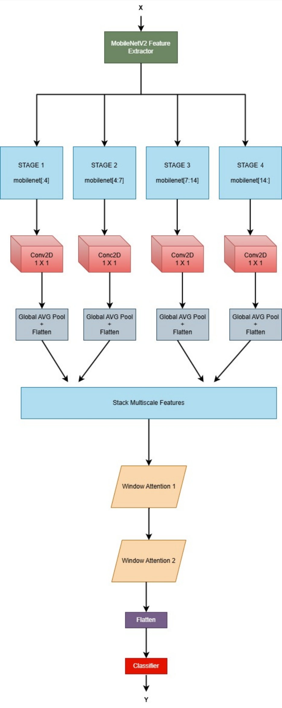
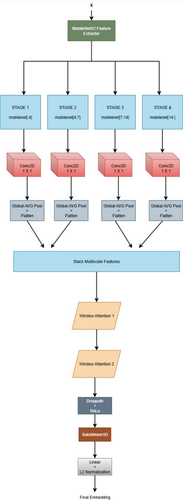

# COMSYS: Lightweight Visual Intelligence using Multi-Scale Features and Attention
** **Test Scripts are provided in folder "Model Weights Files"**
## Training & validation results (Accuracy, Precision, Recall, F1-Score)
### Task A
#### Training
- Accuracy: 0.9709
- Precision: 0.9383
- Recall: 0.9546
- F1-Score: 0.9462
#### Validation
- Accuracy: 0.9479
- Precision: 0.9293
- Recall: 0.8949
- F1-Score: 0.9108

### Task B
#### Training
- Accuracy: 0.9756
- Precision: 0.9765
- Recall: 0.9756
- F1-Score: 0.9756
#### Validation
- Accuracy: 0.7593
- Precision: 0.7850
- Recall: 0.7593
- F1-Score: 0.7537

## Folder Structure

---

## Task A: Image Classification with Multi-Scale Features

### 🔧 Model Architecture

- **Backbone**: MobileNetV2 extracts hierarchical features from 4 stages: `[0:4]`, `[4:7]`, `[7:14]`, `[14:]`.
- **1x1 Convolutions**: Unify the output of each stage to 256 channels.
- **Global Avg Pool + Flatten**: Generates a compact feature vector per stage.
- **Feature Stacking**: Combines all stage vectors into a 3D tensor `(B, 4, 256)`.
- **Window Attention x2**: Applies self-attention across stacked features.
- **Flatten → Classifier**: Outputs class probabilities using a fully connected classifier with softmax activation.

### Training Details

- **Loss**: Categorical CrossEntropy  
- **Optimizer**: Adam  
- **Scheduler**: Learning rate scheduling  
- **Early Stopping**: Enabled to prevent overfitting  
- **Evaluation**: Accuracy & Validation Loss

### Data Augmentation (Albumentations)

- **Geometric**: Resize, Flip, Rotate  
- **Environmental**: Fog, Rain, Sun Flare, Motion Blur  
- **Photometric**: CLAHE, Brightness/Contrast, Gaussian Noise  
- **Normalization**: Mean = 0.5, Std = 0.5

---

## Task B: Visual Similarity Detection with Siamese Network

### Model Architecture

- **Backbone**: Same encoder as Task A (`MSFF_WinAttn_MobileNet_Embedding`)
- **Feature Generation**:
  - MobileNetV2 stages (same splits)
  - 1×1 Conv to unify channel depth
  - Global Average Pool + Flatten
  - Stack → Window Attention (x2)
  - DropPath + ReLU → BatchNorm → Linear Layer → L2 Normalization
- **Output**: Compact embedding vector (e.g., 128-D) for each input image

### How the Siamese Network Works

- **Input**: Image pairs (x1, x2)  
- **Twin Encoders**: Shared-weight `MSFF_WinAttn_MobileNet_Embedding`  
- **Distance**: Absolute difference (L1) between embeddings  
- **Classifier**: Fully connected layer with Sigmoid output  
- **Output**: Probability that the images are of the same identity

### Dataset Preparation

- **Positive Pairs**: Same person, possibly one distorted (e.g., foggy, blurry)  
- **Negative Pairs**: Randomly selected from different identities  
- **CSV Logging**: Each pair and its label (1 or 0) is saved

### Training Strategy

- **Loss**: ContrastiveLoss  
- **Optimizer**: Adam  
- **Class Balance**: Ensured between positive and negative pairs

